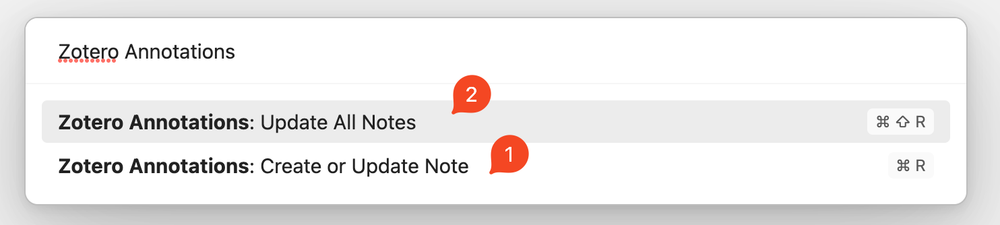
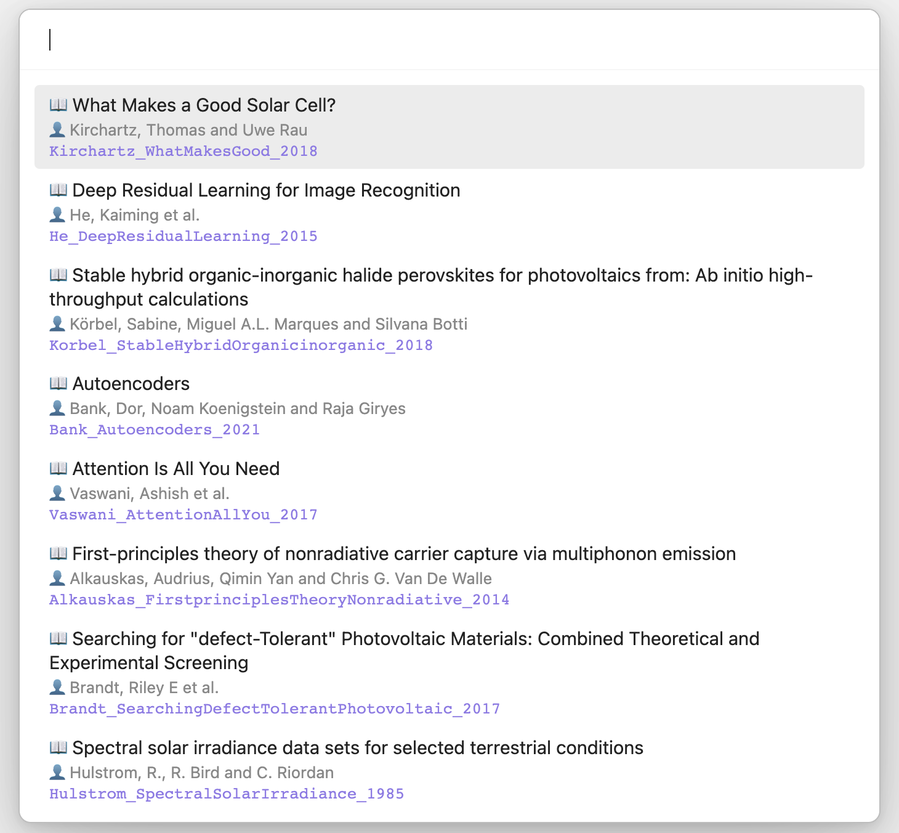
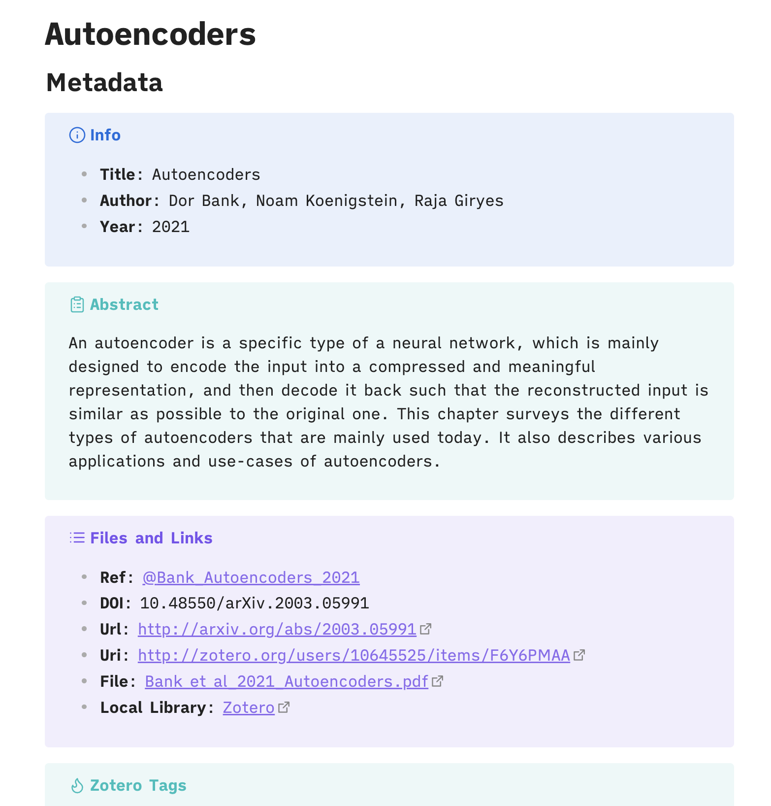
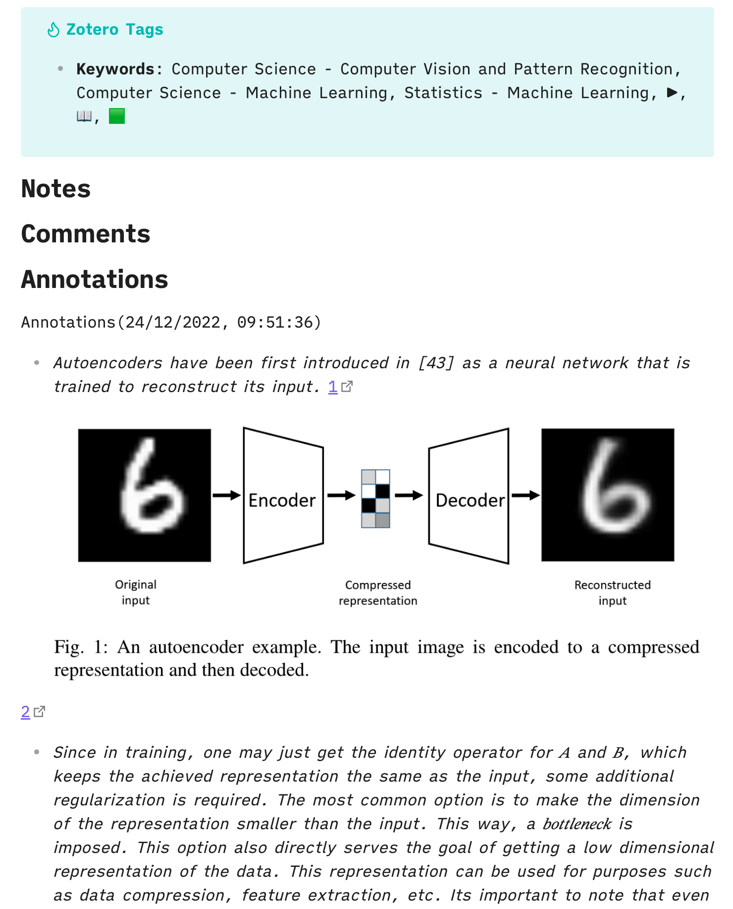

# Zotero Annotations
Import PDF annotation notes and metadata from Zotero to Obsidian.

## Requirements
- [Zotero](https://www.zotero.org/) `v6.x` with [Better BibTeX](https://retorque.re/zotero-better-bibtex/) plugin installed.
    - Export BetterBibTeX JSON file from Zotero to Obsidian vault(Also, In BetterBibTeX settings select `On Change` option in the Automatic Export tab)
- [Obsidian](https://obsidian.md/)

## Installation
The plugin is not available in the community plugin section in Obsidian. So you have to install it manually.
### Manual Installation
1. Download the latest release from [here](https://github.com/anoopkcn/obsidian-zotero-annotations/releases) and unzip it.
2. Copy the `obsidian-zotero-annotations` folder to your vault's `.obsidian/plugins` folder.
3. Reload Obsidian.

You can also use the [BRAT](https://github.com/TfTHacker/obsidian42-brat/) plugin to install the latest release.

## Features
The plugin provides two commands:


1. The `Create or Update Note` will create a note in Obsidian with the metadata and annotations from Zotero. If there are no annotations file associated with a reference in Zotero this command will simply import the metadata. 
2. The `Update All Notes` by default will update all the notes according to the new annotations created in Zotero.  If set to `Create when missing` option in settings it will import and update all the references with annotation available in Zotero. 

**NOTE**: By default, Hotkeys are not set. 

Following is an example of the command `Create or Update Note`:

If you wish to change the default style, you can make a custom CSS(Obsidian settings-> Appearance -> CSS Snippets)

<details>
<summary>CSS Snippet for changing the modal view</summary>

```css
.zaTitle {
    /* my title style goes here */
}
.zaAuthors {
    /* my authors style goes here */
}
.zaCitekey {
    /* my citekey style goes here */
}
```
</details>

## Settings
By default, annotations are created with a plain template. You can provide a custom template by providing the path to the template using the `Template File` option in the settings. 

<details>
<summary>Expand to see the custom template(check the <a href="https://github.com/anoopkcn/obsidian-zotero-annotations/tree/main/templates" alt="templates">templates</a> directory for more)</summary>

```md
---
CiteKey: {{citationKey}}
Type: {{itemType}}
Title: '{{title}}'
Author: '{{author}}'
Publisher: '{{publisher}}'
Journal: '{{publicationTitle}}'
Year: {{year}} 
DOI: {{DOI}}
tags: reference
---

# {{title}}

## Metadata

>[!info] Info
>- **Title**: {{title}} 
>- **Author**: {{author}}
>- **Year**: {{year}} 

>[!abstract] Abstract
> {{abstractNote}}

> [!example] Files and Links 
>- **Ref**: [[@{{citationKey}}]]
>- **DOI**: {{DOI}}
>- **Url**: {{url}}
>- **Uri**: {{uri}}
>- **Eprint**: {{eprint}}
>- **File**: {{file}}
>- **Local Library**: [Zotero]({{localLibraryLink}})

> [!tip] Zotero Tags
>- **Keywords**: {{keywordsAll}}

## Notes

## Comments
{{UserNotes}}

## Annotations
{{PDFNotes}}
```
</details>

This template will produce the following note:



And annotations will look like this but they can be customized:



## Related  or Similar Plugins
This work is inspired by the plugins mentioned in this section. I used all of them and didn't like some of the features. Or some functions that I wanted were not available. **So I decided to borrow some of their code** and make my own plugin. Thanks to the authors. Please try these plugins. They are great.

[stefanopagliari/bibnotes](https://github.com/stefanopagliari/bibnotes)

[hans/obsidian-citation-plugin](https://github.com/hans/obsidian-citation-plugin)

[mgmeyers/obsidian-zotero-integration](https://github.com/mgmeyers/obsidian-zotero-integration)